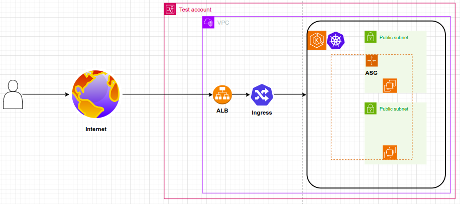
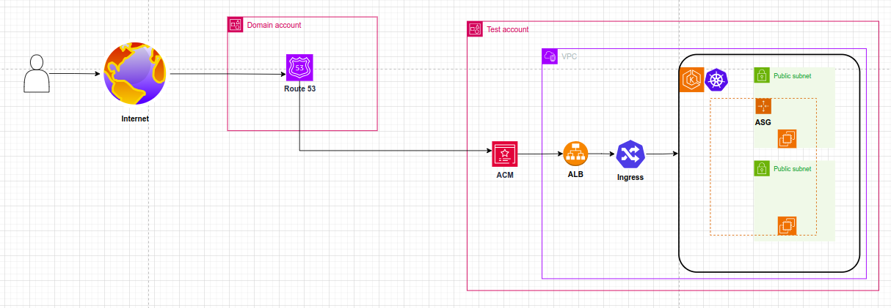

# 📌 Amazon EKS Cluster Deployment Guide

Welcome to the **Amazon EKS Deployment Repository**! This repository contains essential configurations and documentation for deploying and managing an Amazon EKS cluster. 🚀

---

## 📂 Repository Structure

```
📂 Root/
├── 📂 app/ 🚀
│   ├── alb-ingress-iam-policy.json
│   ├── game-2048-ingress.yaml
│   └── game-2048.yaml
├── ⚙️ cluster-config.yaml
├── 📖 docs/
│   ├── 📜 guides/
│   │   ├── 🤖 ai/
│   │   │   ├── 🟡 claude/
│   │   │   │   └── 📑 claude-EKS_Node_Upgrade_Guide_1.27_to_1.28.md
│   │   │   ├── 🔵 kimi/
│   │   │   │   └── 📑 kimi-EKS_Node_Upgrade_Guide_1.27_to_1.28.md
│   │   ├── 🟢 chatgpt/
│   │   │   ├── 📑 chatgpt-EKS_Node_Upgrade_Guide_1.27_to_1.28.md
│   │   │   └── 📑 chatgpt-EKS_Upgrade_1.27_to_1.28.md
│   ├── 📝 summaries/
│   │   └── 📄 summary.md
│   └── 🛠️ troubleshooting/
│       └── ❌ troubleshooting-vpc-cni-error.md
├── 📂 images/
│   ├── game-2048-http.png
│   ├── game-2048-https.png
│   ├── eks-addons.jpg
│   └── eks-version.jpg
├── 🛠️ modifier-commit-messages.sh
├── 🗒️ original-commit-messages.txt
└── 📖 readme.md
```
---

## 📜 EKS Default Addons (Pre-installed by AWS)
Amazon EKS automatically includes several default addons, even when not explicitly assigned in your manifests. These are crucial for the basic functionality and security of the cluster.

### ✅ Pre-installed EKS Addons

1. **Amazon VPC CNI (aws-node)** 🏗️
   - Manages pod networking and assigns VPC IP addresses to pods.
   - Ensures efficient network performance within AWS.

2. **CoreDNS** 🌐
   - Handles DNS resolution for services within the Kubernetes cluster.
   - Essential for service discovery and pod communication.

3. **Kube Proxy** 🔌
   - Maintains network rules on each node for inter-pod connectivity.
   - Implements Kubernetes services using IPTables/IPVS.

### 🔎 Why are these addons pre-installed?
- **Network Connectivity**: `aws-node` (Amazon VPC CNI) ensures pods receive proper networking and can communicate effectively within the AWS environment.
- **DNS Resolution**: `CoreDNS` is required for internal name resolution inside the Kubernetes cluster.
- **Service Routing**: `kube-proxy` enables efficient communication between services and workloads running within the cluster.

Although these addons are included by default, you can upgrade or modify them using the `eksctl` tool or AWS CLI.

---

## 🚀 Getting Started
To deploy the EKS cluster using the provided configuration:

```sh
eksctl create cluster -f cluster-config.yaml
```

For addon management:

```sh
eksctl get addons --cluster minimal-eks-cluster
```

---

# 🚀 Amazon EKS Deployment Guide

This repository contains Kubernetes configuration files, upgrade guides, and troubleshooting documentation for managing an Amazon EKS cluster. It is designed to help DevOps engineers deploy, upgrade, and maintain an EKS cluster efficiently.

---

## 🛠 Features

- **EKS Cluster Configuration** (`cluster-config.yaml`) – Defines the EKS cluster setup.
- **Upgrade Guides** (`EKS_Upgrade_1.27_to_1.28.md`) – Step-by-step upgrade process from Kubernetes 1.27 to 1.28.
- **Troubleshooting** (`docs/troubleshooting/troubleshooting-vpc-cni-error.md`) – Solutions for common EKS networking issues.
- **AI-Generated Insights** (`docs/guides/ai/`) – Different AI-generated approaches for node group upgrades.
- **Commit Message Enhancer** (`modifier-commit-messages.sh`) – Script to format commit messages consistently.

---

## 🏗 Installation & Setup

### 1️⃣ Prerequisites
Ensure you have the following installed:

- [AWS CLI](https://docs.aws.amazon.com/cli/latest/userguide/install-cliv2.html)
- [kubectl](https://kubernetes.io/docs/tasks/tools/install-kubectl/)
- [eksctl](https://eksctl.io/)
- [helm](https://helm.sh/docs/intro/install/)

### 2️⃣ Clone the Repository
```bash
git clone https://github.com/Yoimer/eks-repo.git
cd eks-repo
```

### 3️⃣ Create an EKS Cluster
```bash
eksctl create cluster -f eks/cluster-config.yaml
```

### 4️⃣ Verify the Cluster
```bash
kubectl get nodes
```

---

## 🚀 Usage Guide

### 🛠 Managing the Cluster

- **Check cluster nodes**
  ```bash
  kubectl get nodes
  ```
- **Monitor cluster logs**
  ```bash
  kubectl logs -f <pod-name>
  ```
- **View running services**
  ```bash
  kubectl get svc -A
  ```

### 🔄 Upgrading Kubernetes Version
Refer to the [Upgrade Guide](docs/guides/ai/chatgpt/chatgpt-EKS_Node_Upgrade_Guide_1.27_to_1.28.md) for upgrading from 1.27 to 1.28.

### 🆘 Troubleshooting
- **Networking issues?** See [Troubleshooting VPC CNI](docs/troubleshooting/troubleshooting-vpc-cni-error.md)
- **Pod stuck in `CrashLoopBackOff`?** Run:
  ```bash
  kubectl describe pod <pod-name>
  ```

## 🎮 2048 Game Deployment on EKS

I have added a detailed guide for deploying the **2048 game** on your EKS cluster. This guide includes instructions on how to deploy the game and run it efficiently on your **Kubernetes cluster**.

### 📝 Guide Details

- **HTTP Deployment Guide:** [docs/summaries/game-2048-deployment-http.md](docs/summaries/game-2048-deployment-http.md)
  
- **HTTPS Deployment Guide:** [docs/summaries/game-2048-deployment-https.md](docs/summaries/game-2048-deployment-https.md)
  
- **Key Steps:** Includes Kubernetes manifests and deployment steps for the 2048 game.

Follow the steps in the respective guides to deploy the game and get it running on your **EKS cluster**.

## 🤝 Contributing

We welcome contributions! To contribute:
1. **Fork this repository** and create a new branch.
2. **Commit your changes** using our commit format:
   ```bash
   git commit -m "feat: Updated EKS upgrade documentation"
   ```
3. **Submit a pull request** and describe your changes.

For more details, check [CONTRIBUTING.md](CONTRIBUTING.md).

---

## 📜 License

This project is licensed under the MIT License - see the [LICENSE](license.md) file for details.

---

## 🙌 Acknowledgments

- [Amazon EKS Documentation](https://docs.aws.amazon.com/eks/latest/userguide/)
- [Kubernetes Official Docs](https://kubernetes.io/docs/)
- AI-generated insights from **ChatGPT, Claude, and Kimi**

---

With ❤️ from 🇻🇪

Happy Deploying! 🎉

